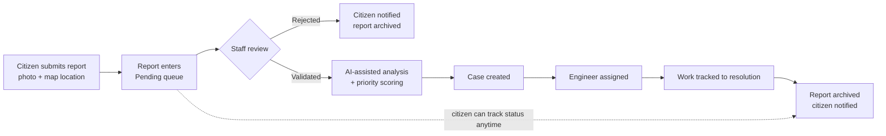
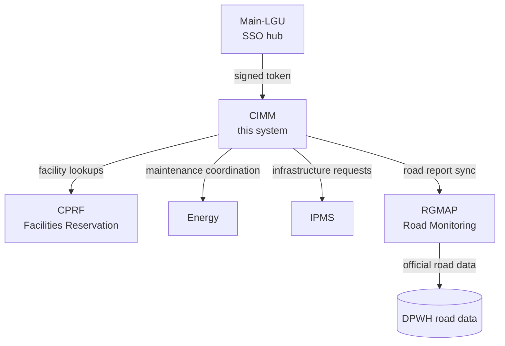

# LGU — CIMM (Community Infrastructure Monitoring & Maintenance)

A citizen-facing infrastructure reporting and repair-coordination platform, built as the **CIMM** system within the larger Main-LGU digital services suite. CIMM lets residents report problems with public infrastructure — potholes, broken streetlights, damaged facilities — and gives city staff the tools to triage, assign, and resolve them, with AI-assisted analysis and live coordination with the city's other systems (facilities, energy, road data).

> Status: School capstone / prototype project. Part of the Main-LGU system suite, accessed via single sign-on.

---

## Overview

Most public infrastructure complaints get lost between a phone call and a work order. CIMM closes that gap with a structured pipeline: a citizen submits a report with a photo and a map pin, staff validate and prioritize it (with AI-assisted analysis), an engineer is assigned and tracked to resolution, and the citizen can follow the status the whole way through — all from one portal.

CIMM doesn't work in isolation. It actively syncs with the city's other digital systems: pulling facility records from CPRF, coordinating maintenance requests with the Energy system, exchanging infrastructure requests with IPMS, and syncing road-specific reports with the separately hosted Road Monitoring (RGMAP) system and official DPWH road data.

---

## Key Features

- **Citizen reporting** — submit infrastructure reports with photos and a map location, view report history, and give feedback
- **Live report tracking** — citizens can track a submitted report's status, with autocomplete/suggestion support when searching for a report
- **Staff triage pipeline** — pending → validated/rejected → current → archived report lifecycle, with priority scoring
- **AI-assisted analysis** — reports can be run through an AI analysis step (Claude API integration) to help staff assess and prioritize issues
- **Case management** — reports are organized into cases that can be tracked and resolved as a unit
- **Engineer assignment** — assign engineers to cases and monitor resolution metrics per engineer
- **In-app chatbot** — a chatbot widget assists citizens with common questions
- **Interactive report map** — reports are plotted on a GeoJSON-based map, alongside official DPWH road data
- **Cross-system sync** — live integration with CPRF (facilities), Energy (maintenance), IPMS (infrastructure requests), and RGMAP (road monitoring)
- **Reporting & export** — generate reports and export them to Word (`.docx`) or Excel (`.xlsx`)
- **Notifications** — in-app and email notifications (via PHPMailer) as a report moves through its lifecycle
- **Role-based access & audit logging** — separate citizen, employee/engineer, and admin roles, with session guarding and an activity log
- **Single sign-on** — staff and admins arrive via a signed SSO token issued by Main-LGU, with no separate login
- **Progressive Web App** — installable on a device, with offline support via a service worker

---

## How It Works

### Citizen report lifecycle

### System integration

---

## Roles

- **Citizen** — submits and tracks reports, gives feedback, uses the chatbot
- **Employee / Engineer** — reviews assigned cases, updates progress, submits feedback
- **Admin** — validates or rejects reports, assigns engineers, manages users, oversees scheduling, and reviews case management and analytics

---

## Tech Stack

`PHP` `MySQL` `PHPMailer` `Claude API (AI-assisted analysis)` `GeoJSON` `Service Worker / PWA`

---

## Notable Modules

- `lgu-portal/includes/api/` — the cross-system bridges (`cimm_cprf_facilities.php`, `cimm_energy_maintenance.php`, `cimm_rgmap_sync.php`, `rgmap_road_reports.php`)
- `lgu-portal/includes/core/` — shared internals: role checks (`roles.php`), session protection (`session_guard.php`), activity logging, priority scoring, `.docx`/`.xlsx` builders, and email notifications
- `lgu-portal/public/functionality/` — the core report workflow: engineer assignment, AI analysis, validation/rejection, DPWH road data, and report export
- `lgu-portal/public/api/` — REST-style endpoints for reports, tracking, notifications, scheduling, and stats consumed by the Main-LGU dashboard
- `integrations/rgmap/` — the bridge that pulls, pushes, and verifies reports exchanged with the Road Monitoring system

---

## Related Projects

- [Main-LGU](https://github.com/EXEQUIELKENT/Main-LGU) — the SSO hub and launcher this system is registered under.

---

## Author

Built by [Exequiel Kent T. Bartolome](https://github.com/EXEQUIELKENT).
